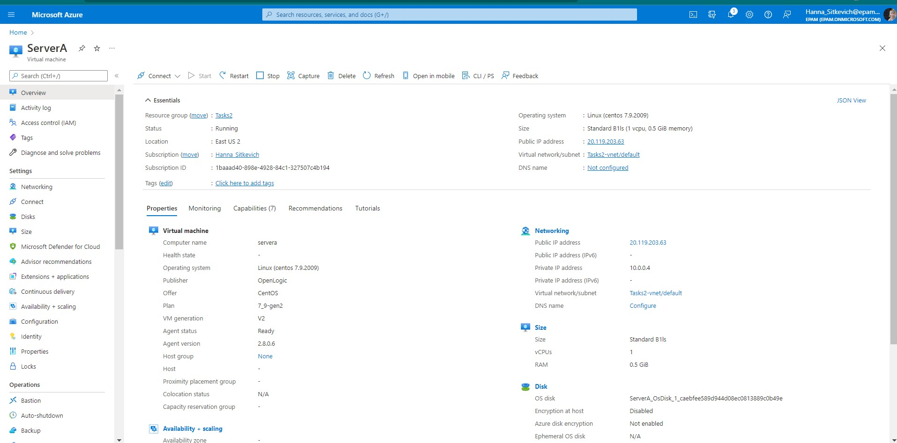
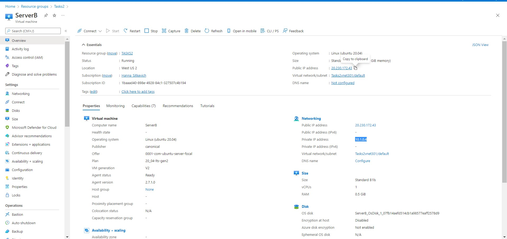
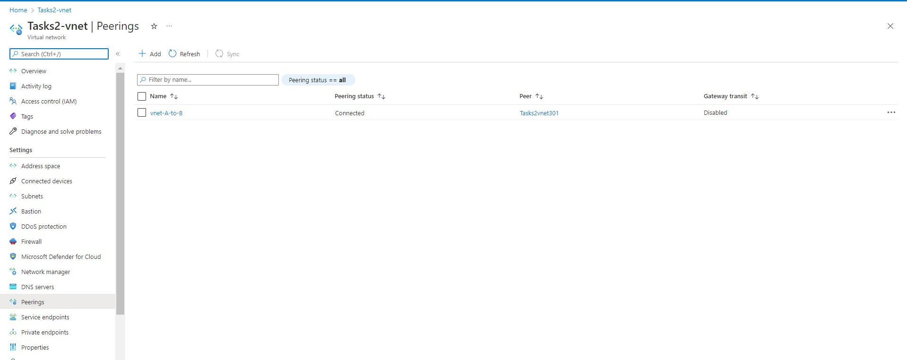
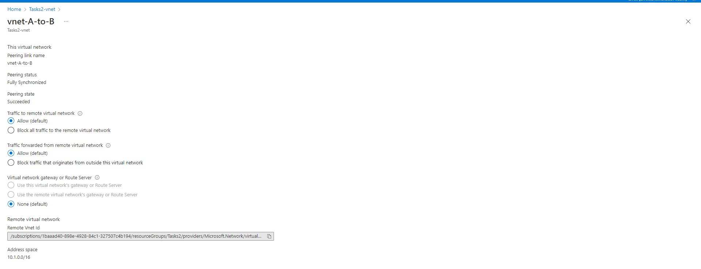

## Task2 ##
ServerB web page:  
http://20.230.172.43/

### I have created two VM: ###
ServerA:
1. Private IP:  10.0.0.4 
2. Public IP: 20.119.203.63

ServerB:
1. Private IP:  10.1.0.4 
2. Public IP: 20.230.172.43

### I have created peering vnet-A-to-B for connecting different networks: ###

With following properties:
