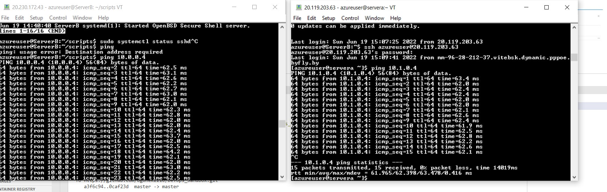
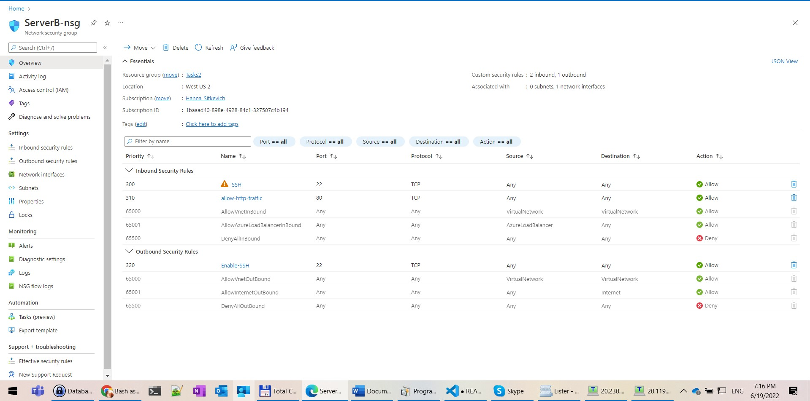
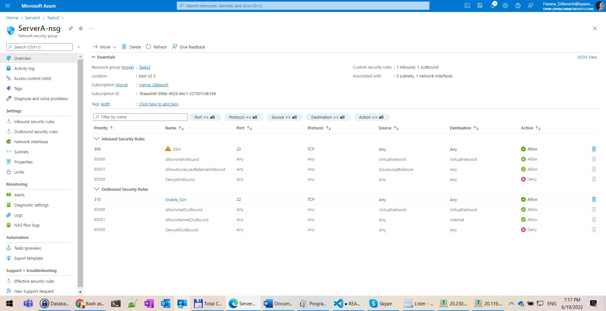
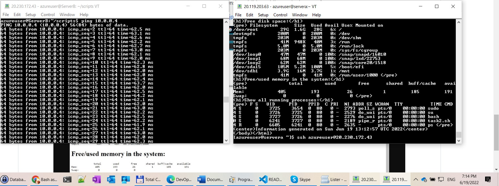
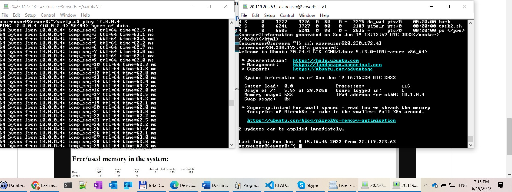
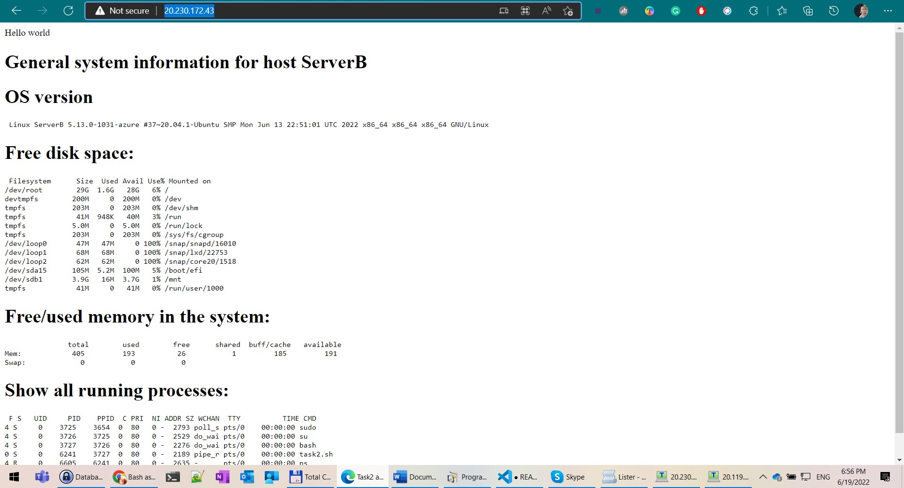
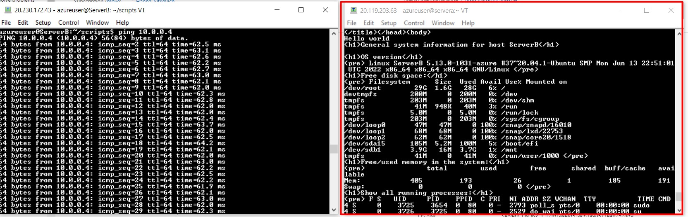
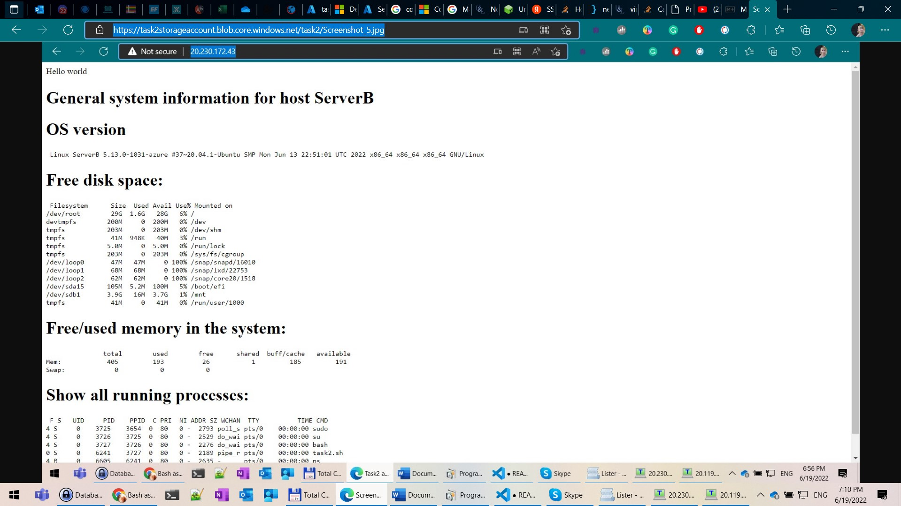

# Task2 #

### I have created two VMs: ###
ServerA:
1. Private IP:  10.0.0.4 
2. Public IP: 20.119.203.63
3. OS: Linux (ubuntu 20.04)

ServerB:
1. Private IP:  10.1.0.4 
2. Public IP: 20.230.172.43
3. OS: Linux (centos 7.9.2009)

### I have created peering vnet-A-to-B for connecting different networks: ###

With the following properties:

Ping ServerA and ServerB:

I have configured the Network security group for serverA and ServerB:

I have configured the SSH between serverA and ServerB:

### ***Optional task*** ### 
The web server Apache is added to the ServerB and I used for it **task.sh** script.

I am able to see the web page via my browser:

I am able to see the web page via the serverA:

### ***Optional (optional) task*** ### 
I created the storage account **task2storageaccount** containing my screenshot visible (public) on the internet for everyone:

https://task2storageaccount.blob.core.windows.net/task2/Screenshot_5.jpg

