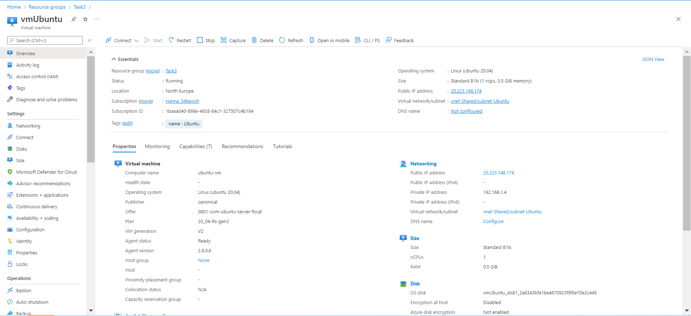
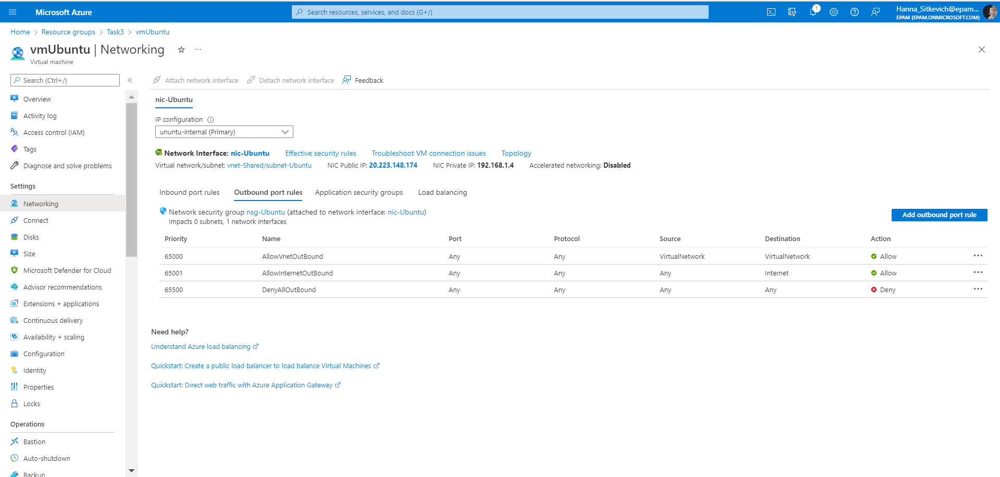
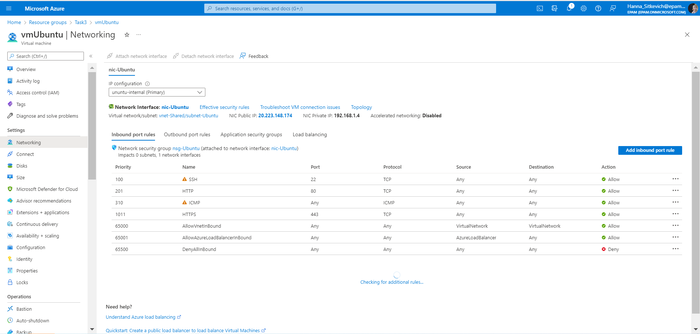
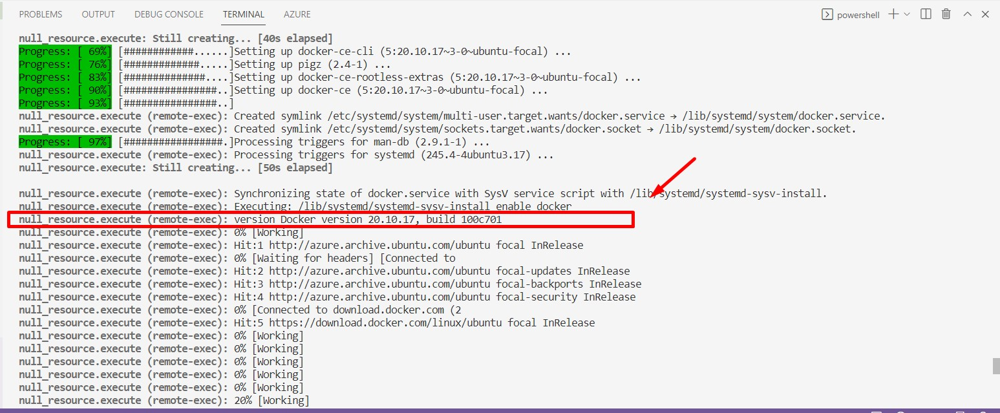
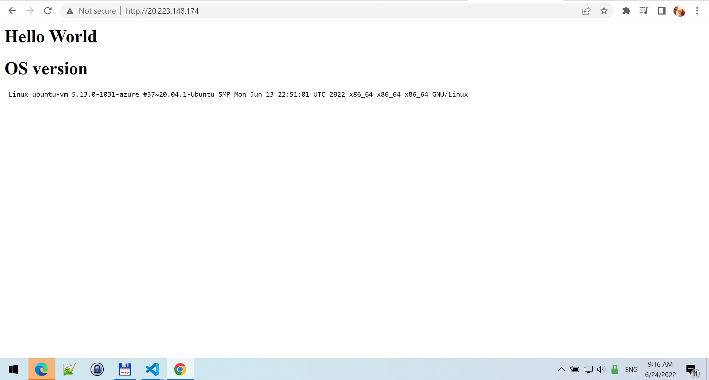
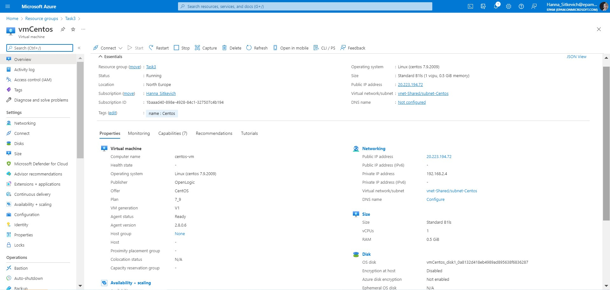
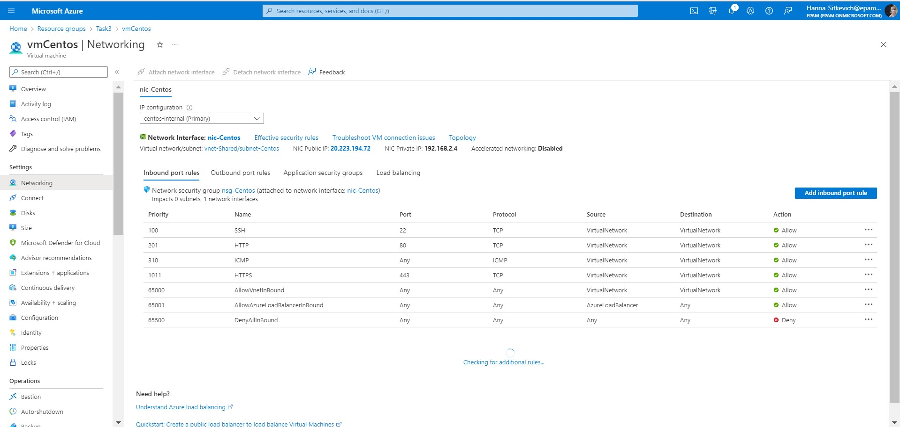
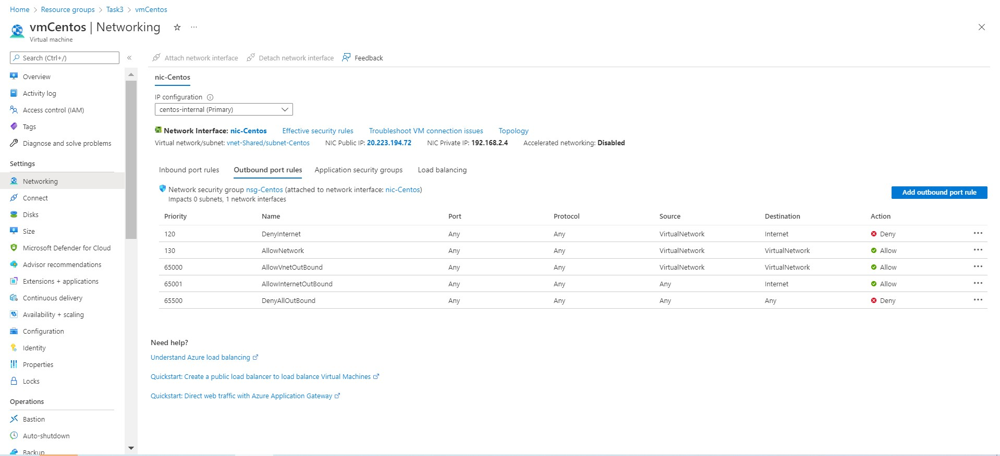
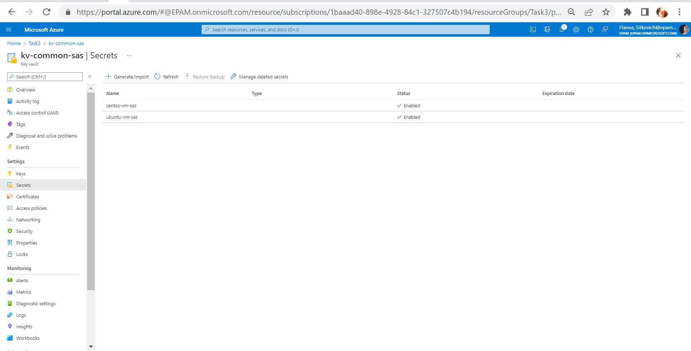

# Task 3: Terraform/IaC introduction #

Tasks:

 1. Create EC2 Instance t2.micro: Ubuntu and CentOS. Both instances must have a tag with names;

 2. EC2 Ubuntu must have Internet access, there must be incoming access: ICMP, TCP/22, 80, 443, and any outgoing access;

 3. EC2 CentOS should not have access to the Internet, but must have outgoing and incoming access: ICMP, TCP/22, TCP/80, TCP/443 only on the local network where EC2 Ubuntu, EC2 CentOS is located;

 4. On EC2 Ubuntu, install a web server (nginx/apache); Create a web page with the text “Hello World” and information about the current version of the operating system. This page must be visible from the Internet;

 5. On EC2 Ubuntu install Docker, installation should be done according to the recommendation of the official Docker manuals.

### The configuration of the Ubuntu OS: ###

### The docker and apache were installed in the  Ubuntu OS: ###

### The configuration of the Centos OS: ###

The **KeyVault** is used for maintaning the passwords of Ubuntu and Centos virtual machines:

### Extra: ###
1. I created the following resource for using id of the existing Ubuntu VM for transfering his private IP to the network security group of Centos VM : 

*"azurerm_virtual_machine" "ubuntu_vm"*
