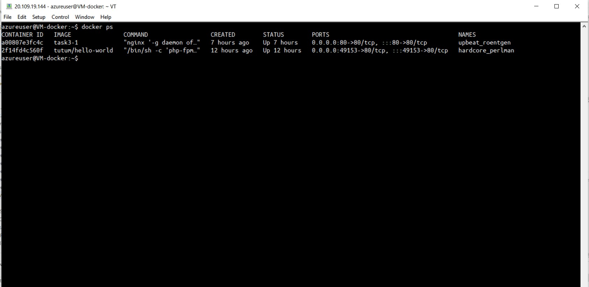

# Task 4 #

<ol>
  <li>Install docker. (Hint: please use VMs or Clouds  for this.
    
<b>EXTRA 1.1.</b><i> Write bash script for installing Docker. 
</i></li>
    
  <li>Find, download and run any docker container "hello world". (Learn commands and parameters to create/run docker containers.

<b>EXTRA 2.1.</b> <i>Use image with html page, edit html page and paste text: Username 2022</i>
</li>
  <li>Taks 3:
    <ol>
      <li> Create your Dockerfile for building a docker image. Your docker image should run any web application (nginx, apache, httpd). Web application should be located inside the docker image. 
      <ol>
<b>EXTRA 3.1.1.</b> <i>For creating docker image use clear basic images (ubuntu, centos, alpine, etc.)</i>
</ol>
      </li>
      <li>Add an environment variable "DEVOPS=<username> to your docker image 
 <ol>
<b>EXTRA 3.2.1.</b> <i>Print environment variable with the value on a web page (if environment variable changed after container restart - the web page must be updated with a new value)</i>
</ol></li>
    </ol>
  </li>
  <li>Push your docker image to docker hub (https://hub.docker.com/). Create any description for your Docker image. 
<b>
EXTRA 4.1.</b><i> Integrate your docker image and your github repository. Create an automatic deployment for each push. (The Deployment can be in the “Pending” status for 10-20 minutes. This is normal).</i>
</li>
<li> Create docker-compose file. Deploy a few docker containers via one docker-compose file. 
first image - your docker image from the previous step. 5 nodes of the first image should be run;
second image - any java application;
last image - any database image (mysql, postgresql, mongo or etc.).
Second container should be run right after a successful run of a database container.
	
<b>EXTRA 5.1.</b> <i>Use env files to configure each service.</i>
</li>
</ol>

__Task 1.1:__ Docker is installed via the script - *"Extra 1.1"/script-1.sh*

__Task 2.1:__
1. Pull the "hello-world" image:
*docker pull tutum/hello-world*

2. List images:
*docker image ls*

3. Create image:
   *docker build -t tutum/hello-world .*

4. Build image:
*docker run -p 80:80 -d hello-world*

5. Start the image: *sudo docker run -d -p 80 tutum/hello-world*
   
6. It will print the new container ID (like 31e17b0746e4). Get the allocated external port: *sudo docker port 31e17b0746e4 80*

7. List of all running images:
 

8. Edit the web page inside the existing container: *docker exec -it hardcore_perlman /bin/sh*
   
   

9. Check the localhost:
   

__Task 3.1.1:__
1. I have created the following *dockerfile* and *index.html* files for the integration *nginx* to the centos 7 - *"./Extra 3.1/Dockerfile3"*

2. Build the docker image:
    *docker build -t task3-1 -f Dockerfile3 .*

3. Run the docker image: 
    *docker run -d -p 80:80 task3-1*

 
 

__Task 3:__

Dockerfile3:
 

Build the docker image and run it:
*docker build -t task3-2 -f Dockerfile3 .*

*docker run -d -p 81:80 task3-2*

Check that the "task3-2" docker container is working:

