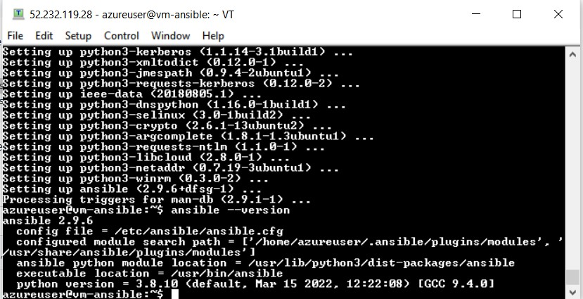
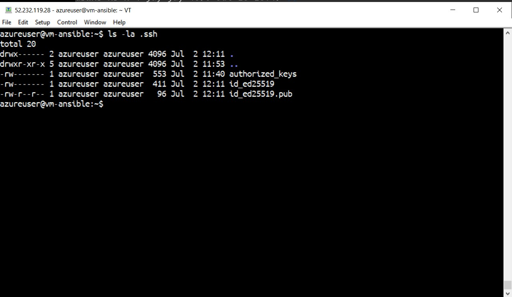
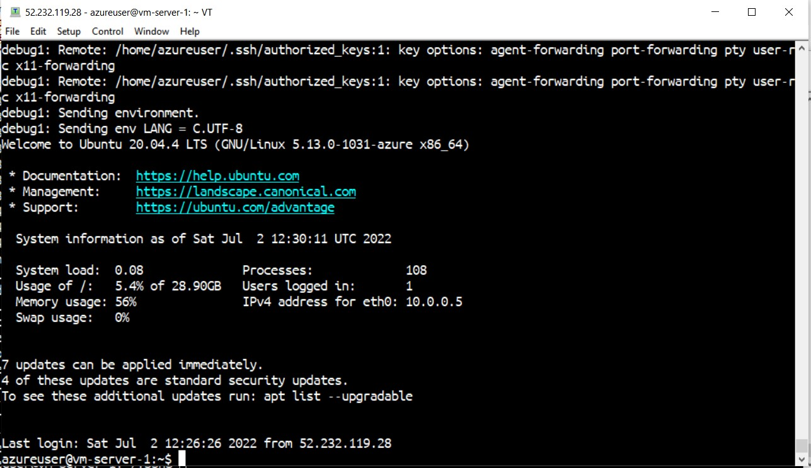
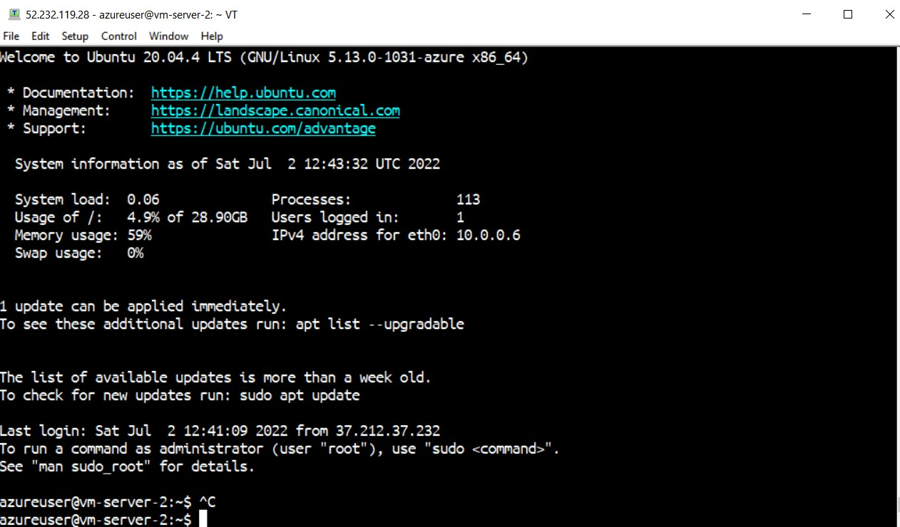
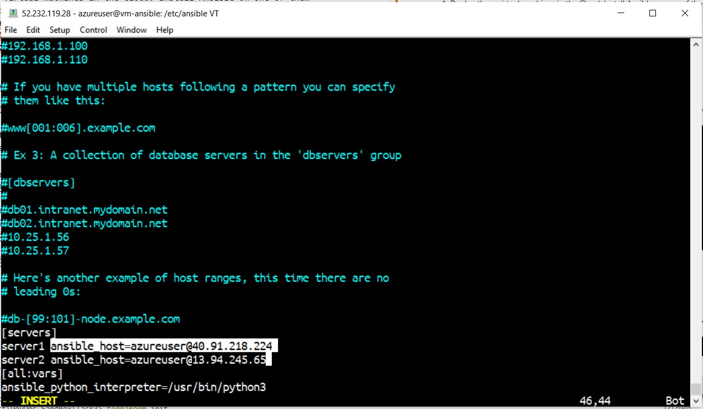
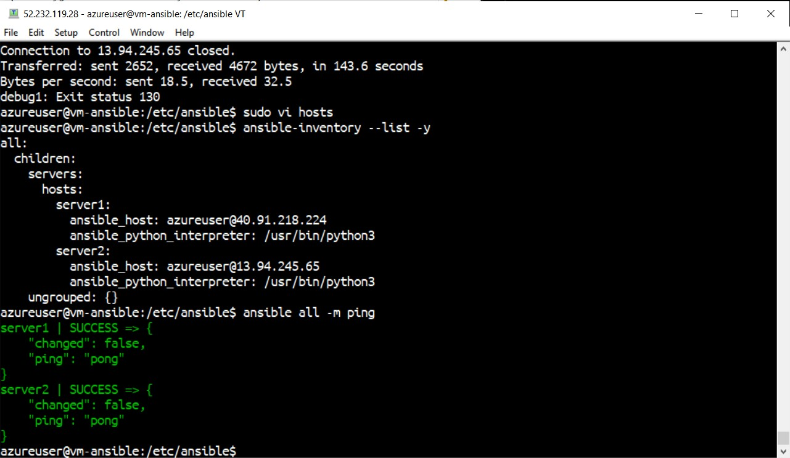
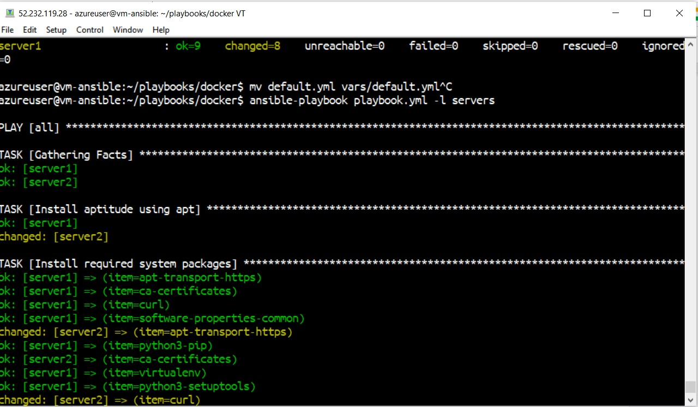
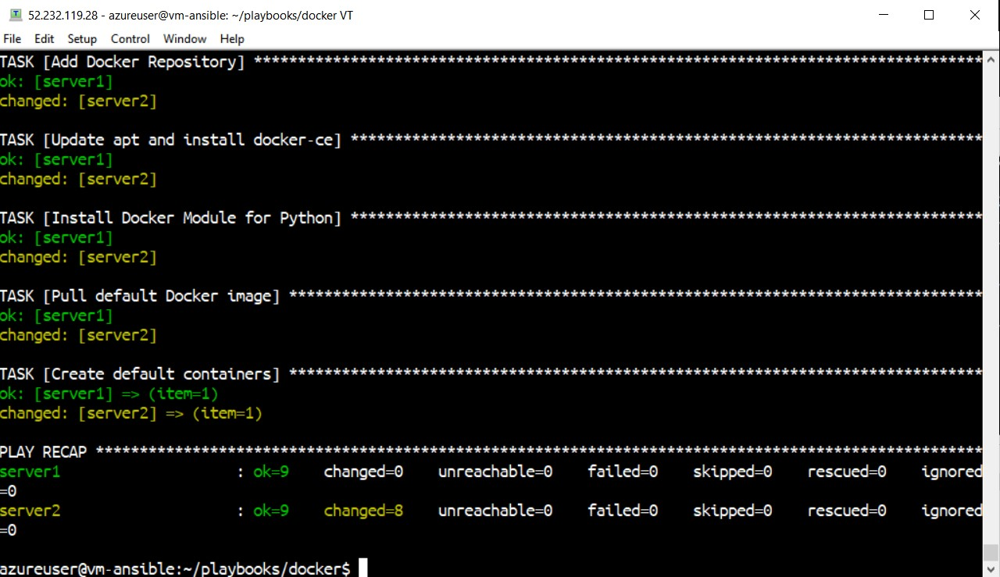
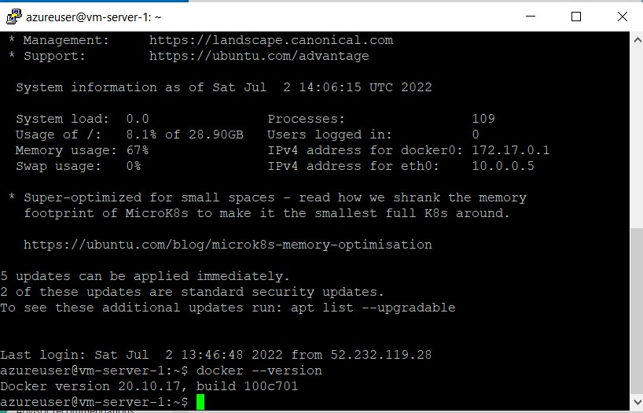
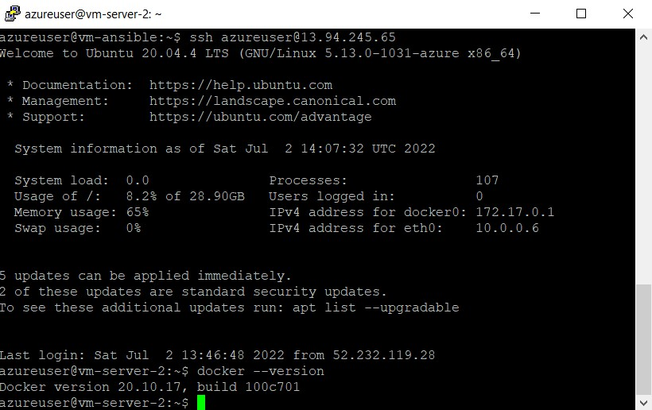

# Task5 #

1. Deploy three virtual machines in the Cloud. Install Ansible on one of them (control_plane):
   ## vm-ansible - 52.232.119.28 (ansible host) ##
   ## vm-server1 - 40.91.218.224 ##
   ## vm-server2 - 13.94.245.65 ##

*VM1:* 

Step for installing ansible:

- sudo apt update
- sudo apt install ansible

Generate ssh key (*ssh-keygen -t ed25519 -C "key vm-ansible"*): 

Copied the value of *~/.ssh/id_ed25519* file to the *~/.ssh/authorized_keys* on the azureuser@40.91.218.224 vm:

Changed the cd */etc/ansible.hosts*:

Run the playbook for installing the docker on two VMs: *ansible-playbook playbook.yml -l servers*
Results:

