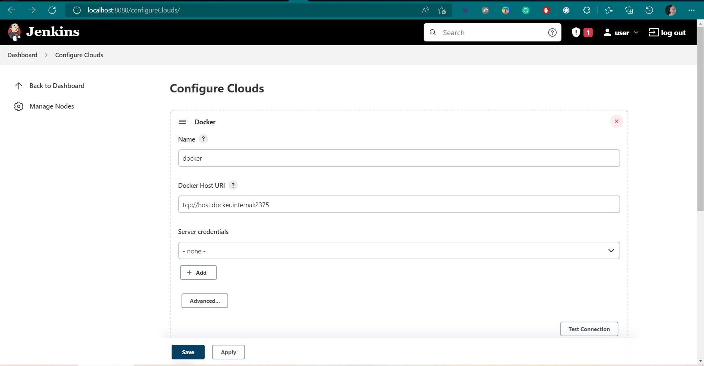

# Task6 #
Tasks:
1. Installed Jenkins which was installed in a docker container  according to the [article](https://dev.to/ductnn/install-jenkins-with-docker-3lfe).

2. Installed necessary plugins:
   
   

3. Configured several 2 build agents. Agents must be run in docker:
   The first agent was created according to the [documentation](https://www.jenkins.io/doc/book/using/using-agents/)

    

    

4. Created a Freestyle project. Which will show the current date as a result of execution:
   
   

5. Created Pipeline which will execute docker ps -a in docker agent, running on Jenkins master’s Host:
   
   

6. Create Pipeline, which will build artifact using Dockerfile directly from your github repo (use Dockerfile from previous task):

   

   
   
7. Pass  variable PASSWORD=QWERTY! To the docker container. Variable must be encrypted!!!
   
   

