# Task 7 #

# Zabbix: # 

1. Installed on server, configure web and base using the 
 *docker-compose-server-zabbix.yaml*.
  
  Installed docker-compose on Ubuntu 20.04 (zibbix-server - 10.0.0.5):
   - *sudo apt-get install apt-transport-https ca-certificates curl  gnupg lsb-release*
   - *curl -fsSL https://download.docker.com/linux/ubuntu/gpg | sudo gpg --dearmor -o /usr/share/keyrings/docker-archive-keyring.gpg*

   - *echo "deb [arch=amd64 signed-by=/usr/share/keyrings/docker-archive-keyring.gpg] https://download.docker.com/linux/ubuntu $(lsb_release -cs) stable" | sudo tee /etc/apt/sources.list.d/docker.list > /dev/null*
  
   - *sudo apt-get update*
   - *sudo apt-get install docker-ce docker-ce-cli containerd.io docker-compose*
   - *sudo usermod -aG docker $USER*

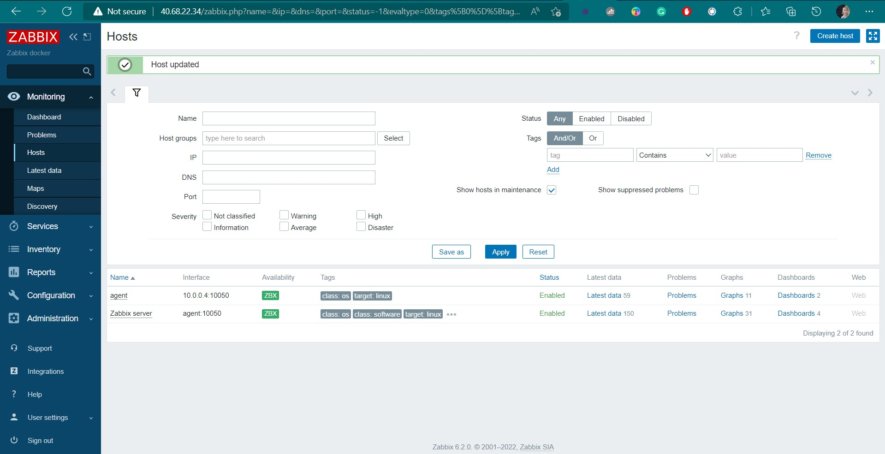

2. Prepare VM or instances (vm1 - IP 10.0.0.4 and vm2 - IP 10.0.0.6):

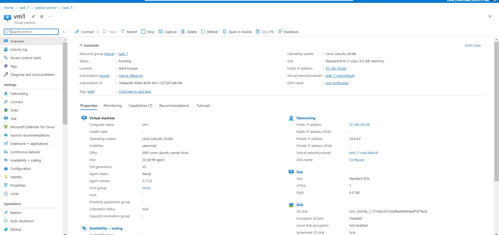

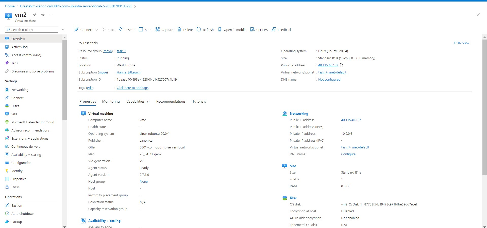

3. Install Zabbix agents on previously prepared servers or VM:
   - *sudo apt-get update*
   - *sudo apt install zabbix-agent*
   - *vi /etc/zabbix/zabbix_agentd.conf*
   - *sudo systemctl restart zabbix-agent.service*
   
   

4. Make several of your own dashboards, where to output data from your host/vm/container (one of them):
   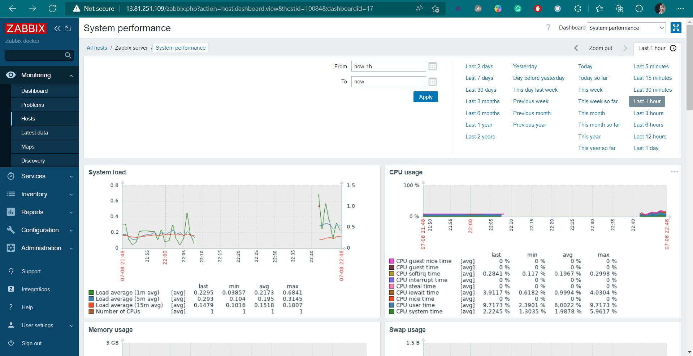

   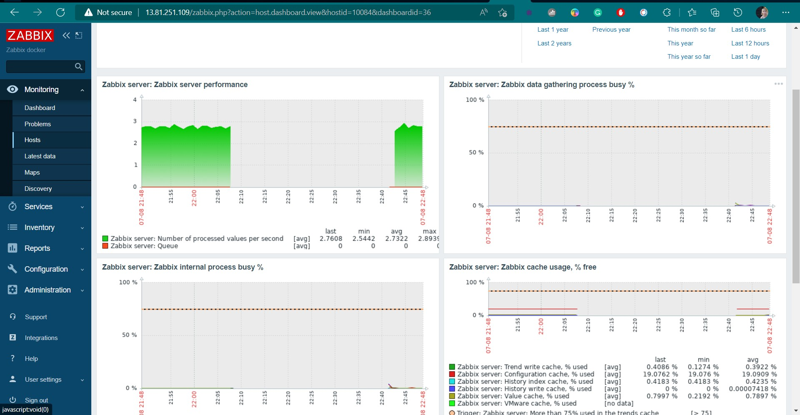

   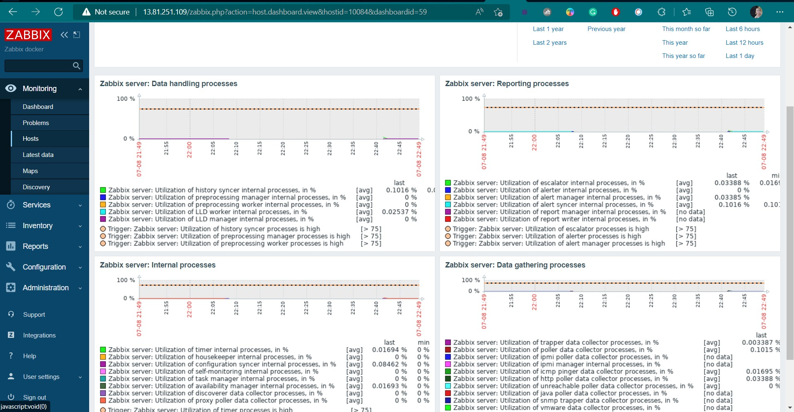

   

5. Active check vs passive check - use both types:
   
   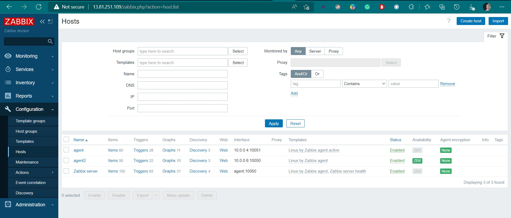

   Latest data from VM1 using the active agent with the following configuration:
   
   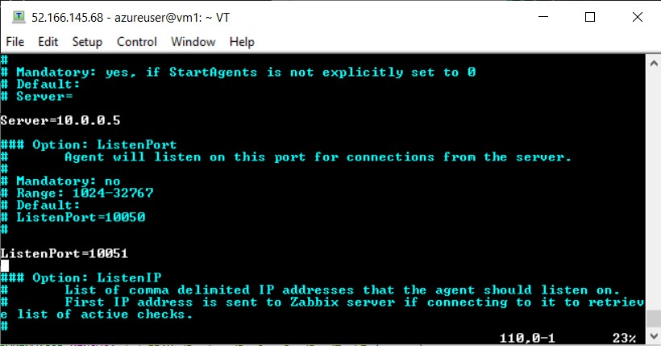

   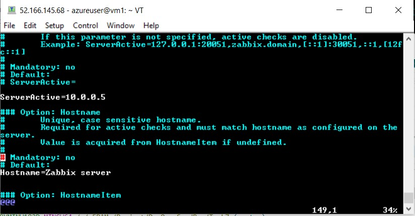

   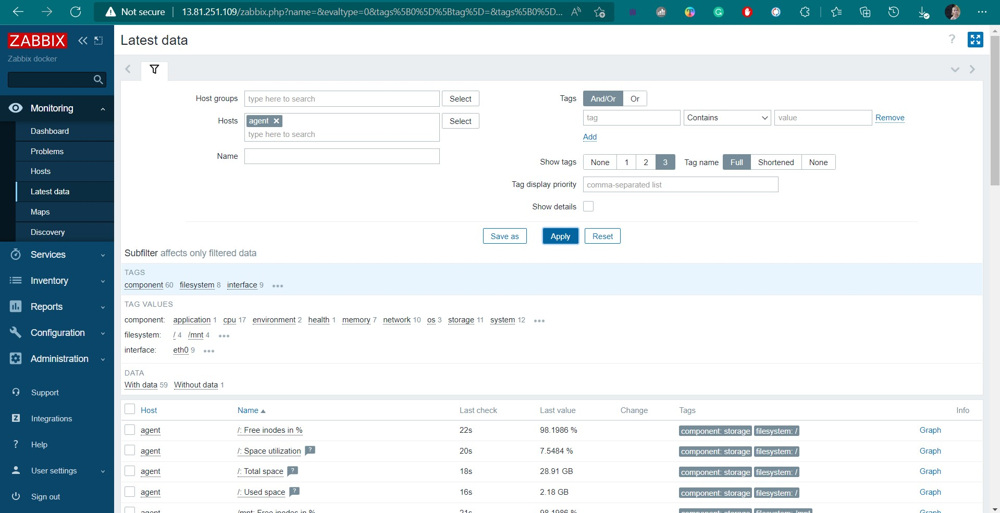

   Latest data from VM2 using the the passive agent with the following configuration:

   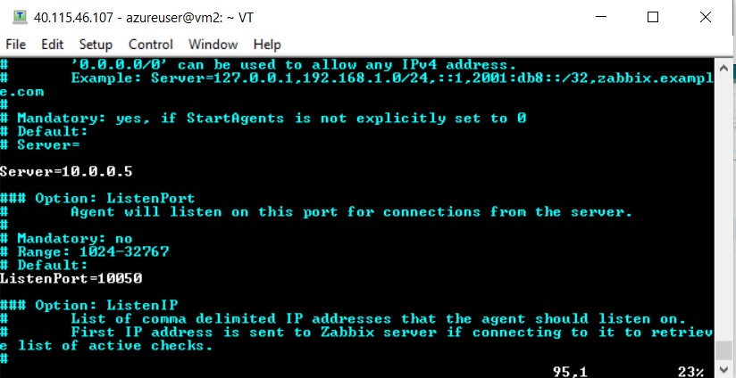

   

6. Make an agentless check of any resource (ICMP ping)
7. Provoke an alert - and create a Maintenance instruction
8. Set up a dashboard with infrastructure nodes and monitoring of hosts and software installed on them
