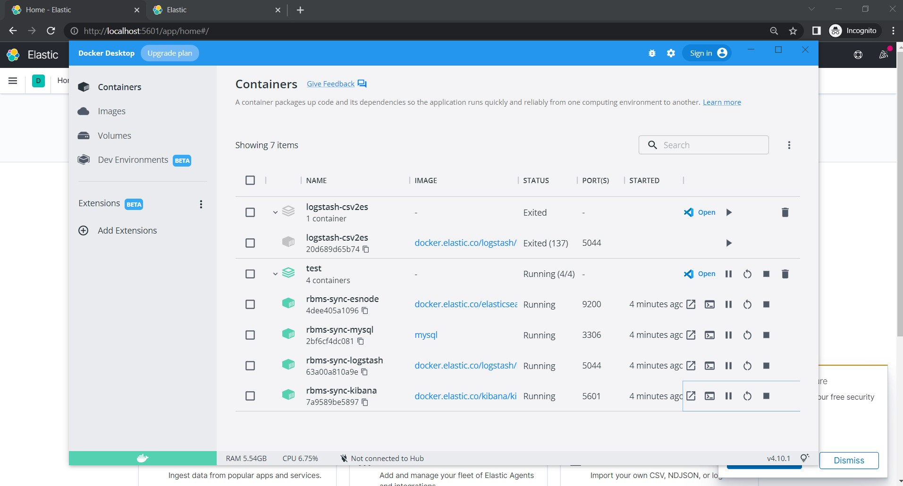
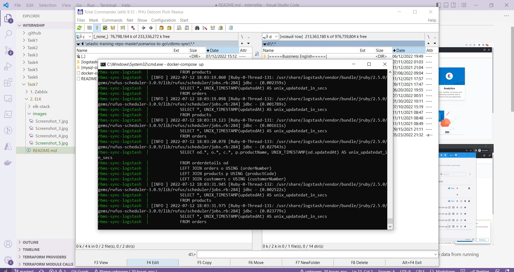
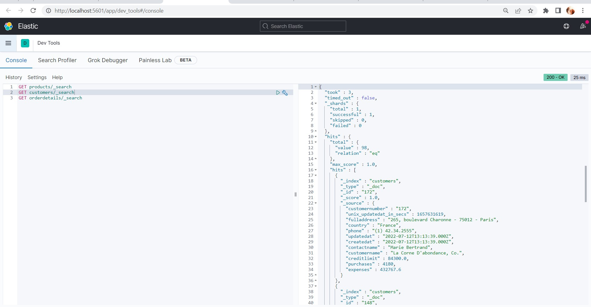
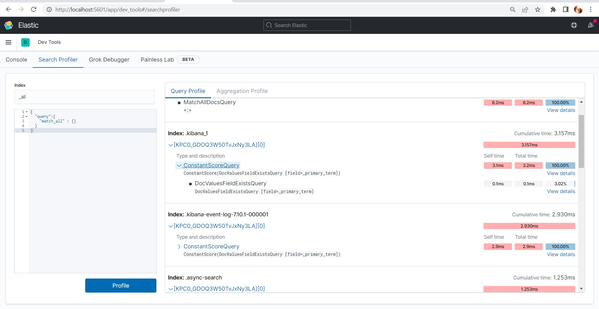
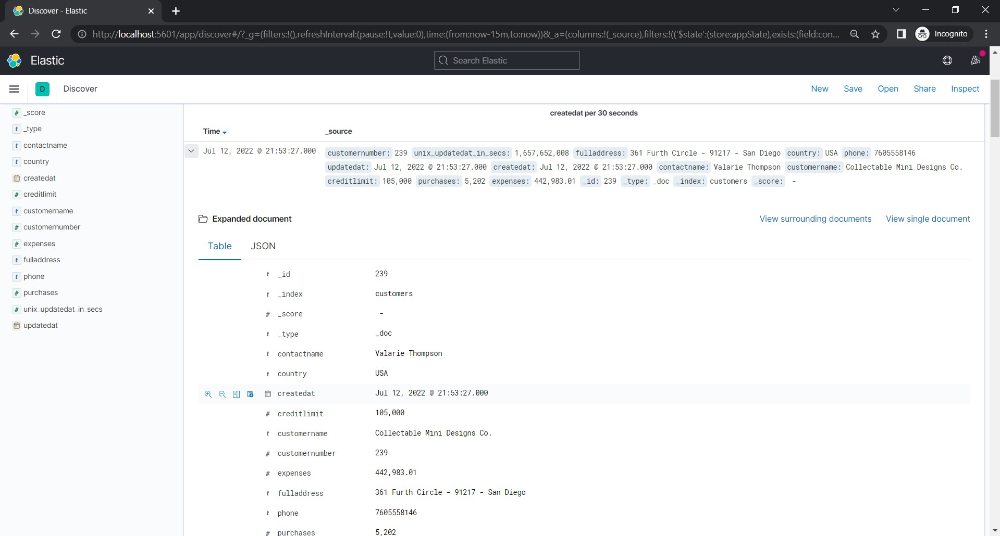

# ELK: # 

1. Install and configure ELK via  [docker-compose.yml](https://github.com/ogonek2210/internship/tree/master/Task7/2.%20ELK/elk%2Bmysql):

2. Organize collection of logs from docker to ELK and receive data from running containers:

3. Customize your dashboards in ELK:

